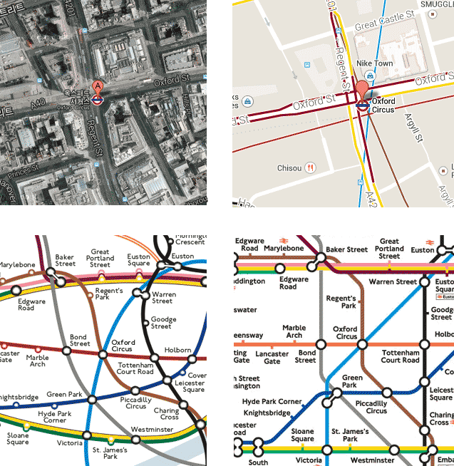
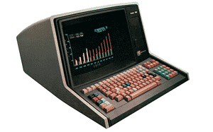
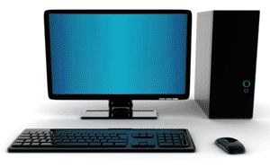
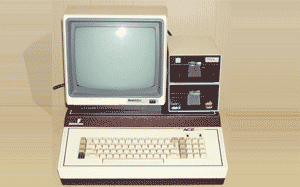
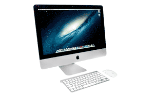

# 생활코딩 - 객체지향

https://youtu.be/9BVi9ygdWs0

https://youtu.be/5NmyjJdoLZM

https://youtu.be/y7Z_Wpgmz-Q

**아래 내용은 이고잉님의 생활코딩 객체지향 프로그래밍을 본 정리 글입니다.**

##OOP

OOP(Object-Oriented-Programming) - 객체지향 프로그래밍
PP(Proceduaral Programming) - 절차지향 프로그래밍

위 OOP와 PP는 서로 대립되는 관계가 아니라 대비되는 관계

~~~
 Object-Oriented-Programming
----------------------------
  Proceduaral Programming
~~~

PP를 기반으로 OOP가 탄생했고 PP의 부족한 부분을 보완해주는 역활을 한다.

- PP와 OOP의 차이는 PP는 함수 중점이고 OOP는 객체 중점이다.

  (함수보다 더 큰 틀인 객체)

**객체지향프로그래밍이란?**

- 로직(변수,메소드)을 기능별로 그루핑해서 객체로 만드는것
  - 그루핑하면서 다른 곳에서도 사용가능하게 됨으로 **재활용성**이 높아진다
- 객체란 것은 추상적으로 생각한 대상이 아니고 구체적인 문법인 기능이 언어차원에서 제공되는 것
- 하나의 객체가 가지고 있는 취지, 기능과 연관된 변수와 메서드를 객체 안에 가두는것
- 연관성 없는 다른 로직(변수,메소드)과 구분해두는것

## 설계와 추상화

#### 설계

현실 -> SW(소프트웨어)

현실에서 관심있는 어떠한 관점을 SW화 시켜서 어떠한 문제를 해결하는것이 프로그래밍

하지만

현실은 아주 복잡하고 SW는 현실보단 단순하다.

1. 위성사진
2. 일반지도사진
3. 복잡한걸 제거하고 지하철 노선을 표시한 지도
4. 3번 지도를 개선한 지도로써 지하철이용객에게 불필요한 정보를 제거하고 유일한 관심사인 환승역, 도착지까지 몇개의 역이 있는지 등의 정보만 담고 있다.

1,2,3,4번 지도는 같은 지역을 표시한 지도이다.

만약 지하철로 어느지역을 이동하고 싶다면 1,2,3번 보다는 4번지도를 선호할것이다.

1번지도는 현실이고

4번지도는 현실에서 우리의 관심 또는 관점에 초점을 맞춰서 필요로 한것만 추출해낸 것이다

이러한 필요한 정보만 모아서 간단하게 만든것을 **추상화(abstract)** 라고한다.

**정리**

소프트웨어를 설계한다는것은 **복잡한 현실을 추상화**하는 과정으로 볼 수 있다.

## 부품화

###하드웨어에서 일어나고 있는 부품화

초창기의 컴퓨터는 어떠한 부분이 고장날 경우 전체를 바꿔야할 것이다.

그리고 초창기 컴퓨터를 그루핑와 추상화를 통해서 모니터,본체,마우스,키보드를 쪼개서 부품화를 한것이다. 이제 초창기 컴퓨터와 다르게 모니터,본체 등 고장나면 그 부분만 교체하던지 문제가 생기면 문제 파악이 더 편리해졌다.

하지만 완제품을 어떻게 부품화를 한것인가에 대해서는 쉬운 문제는 아니다.

위 컴퓨터는 모니터와 저장장치를 부품화 했지만 키보드와 본체는 부품화 하지 않았다.

위 컴퓨터는 가장 근래의 컴퓨터로 최신 컴퓨터이다.

하지만 키보드와 마우스는 부품화 했지만 모니터와 본체는 나누지 않았다.

고장이나 문제파악에 있어서는 모니터,본체,마우스,키보드 등을 각각 부품화로 하는게 효율적이지만 여러 이유로 인해서 어떻게 추상화 또는 부품화할것이냐에 대한 관점이 바뀌어 가고 있다.

**정리**

부품화, 설계 라는 것이 고정된 방법이나 정답이 없다라는 것을 알아야한다.

자신이 처해있는 환경에서 **적합함** 을 찾는것이 우리에게 주어진 숙제이다.

부품화의 예로써 메소드이며

메소드의 사용 취지는 연관된 로직들을 결합하여 메소드라는 완제품으로 만들고 이 메소드들을 부품으로 해서 하나의 완제품인 독립된 프로그램을 만들면 **코드의 양을 극적으로 죽일 수 있고**, **메소드 별로 기능이 분류되어 있기 때문에 필요한 코드를 찾기가 더 쉽고 문제 진단도 빨라진다.**

하지만 프로그램이 커지면서 많은 메서드가 생겨나고 메소드가 없을때 처럼 관리가 점점 더 어려워지고 이 메소드들을 묶어줄 더 큰 개념이 필요하게 된것이다.

## 은닉화,캡슐화

모니터가 어떻게 동작하는지 몰라도 컴퓨터와 모니터를 연결하는 방법만 알면 화면을 표시할 수 있는것 처럼

내부의 동작 방법을 단단한 케이스**(객체)** 안에 숨기고

사용자에게는 그 푸품의 사용법**(메소드)**만을 노출 하는 것

이러한 컨셉을 정보의 은닉화(Information Hiding), 캡술화(Encapsulation) 라고 부른다.

## 인터페이스

잘 만들어진 부품이라면 부품과 부품을 서로 교환 할 수 있어야 한다.

A사의 모니터를 사용하다가 B사의 모니터를 연결 할 수 있다. 반대로

A사의 본체를 사용하다가 B사의 본체를 쓰더라도 기존의 모니터를 계속해서 사용할 수 있다.

모니터와 본체는 서로가 **교환관계**에 있다

이것은 모니터와 본체를 연결하는 **케이블의 규격이 표준화** 되어 있기 때문이다.

본체와 모니터를 만드는 업체들은 케이블의 규격을 공유하고 서로가 어떻게 만들어 지는지 신경쓰지 않는다. 각각의 부품은 미리 정해진 약속에 따라서 신호를 입,출력하고 연결점의 모양을 표준에 맞게 만들면 된다. 이러한 연결점을 **인터페이스(interface)** 라고한다.

인터페이스가 있기 때문에 이질적인 것들과 결합을 막아주는 장치이다.

### 정리

객체를 부품에 비유하며 설명했지만 **비유는 비유일뿐** 이다.

비유는 의도한 유사점 뿐만 아니라 의도하지 않은 차이점까지도 전달될 가능성이 있다.

하드웨어는 소프트웨어가 아니기 때문에 하드웨어가 할 수 없는 것들을 소프트 웨어는 할 수 있다 그 대표가 **복제와 상속**이다.
