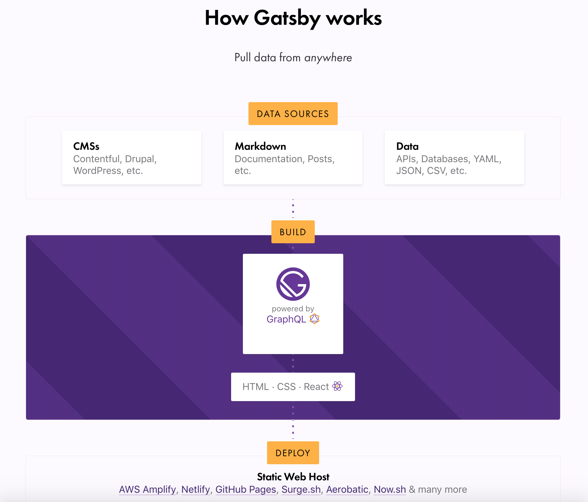

##Gatsby를 선택한 이유

첫 글인만큼 어떻게 시작할지 고민을 많이 했다.

원래는 Tistory로 블로그를 운영하고 있는데 정적 사이트에 대한 관심을 가지면서 개츠비로 이전하게 되었다.

개츠비는 **정적 사이트 생성기(Static site Generator)**로써 최근 Netlify와 Gatsby를 중심으로 인기있는 생성기이다. **Netlify**는 정적 사이트를 배포하는 방식이다. 여기서 정적 사이트라는건 HTML, CSS, JavaScript로만 만들어진 사이트 이다.

나한테 있어서는 블로그를 만들어보고 운영하는데 있어서 많은 공부와 도움이 되었다고 생각이 든다.

보통 정적 사이트는 사용하는 문서를 빌드할 때 HTML로 만들고 글을 작성할때에는 Markdwon을 사용하기 때문에 블로그로 많이 적합하다고 생각한다.

Gatsby는 React를 사용하면서 웹사이트 제작을 쉽게 할 수 있도록 편의 기능을 많이 제공하고 최근 몇년전부터 React, Vue 등의 인기와 수요가 늘면서 React를 능숙하게 다루는 사람들이 늘어났고 그런 사람들에게 있어서는 더 할 나위 없는 잘 만들어진 도구라고 느꼈다.

위 이미지는 Gatsby 홈페이지에 있는 Gatsby의 동작 방식을 설명해 주는 이미지이다.

간단하게 보자면 **데이터소스** 부분(Gatsby에 있어서 DATA Sources부분)에 있어서 여러가지 장점이 있다. 워드프레스와 같은 CMS구조, Markdown 파일이 될 수 있고, API, JSON등의 DATA를 통해 외부에서 가져올 수 있다.

Gatsby는 **GraphQL을 기본적으로 사용**하여 **빌드** 부분에서 데이터소스에서 데이터를 가져오고 있다. 다른 방법도 있겠지만 GraphQL로 인해서 데이터에 있어서는 훨씬 편하게 쓸 수 있도록 했다.

(GraphQL에 있어서는 조금 공부가 필요하다고 생각이 든다. 추후 공부해서 포스팅할 예정이다.)

데이터부분을 지나면 HTML, CSS, React를 사용하여 Gaysby를 구성하고 **공통 레이아웃을 관리하거나 페이지 생성등 데이터 소스와 컴퍼넌트 연결**에 있어서 **React 사용**하여 쉽게 구성하고 있다.

이 과정을 거치면 정적 사이트(Static site)를 만들어주며 Host는 AWS, Netlify GitHub Pages 등으로 가능한데 **Netlify를 추천**하고 있고 실제로 사용해보니 편한부분이 많다.

## 블로그를 이용한 공부에 대해서

