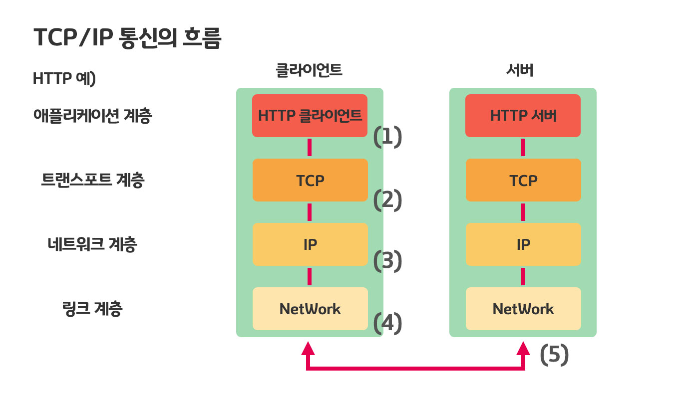

## 웹과 네트워크의 기본

### 네트워크의 기본은 TCP/IP

우리가 일반적으로 사용하는 인터넷과 네트워크는 TCP/IP라는 프로토콜로 움직이고 있다. 그중에 하나가 HTTP다

### TCP/IP는 프로토콜의 집합의 총칭

컴퓨터와 네트워크 기기는 통신을 하기 위해서는 **서로 같은 방법이 아니면 통신하지 못한다.** 같은 방법으로 통신하기 위해서는 **규칙**이 필요하다. 서로 통신을 하기 위해서는 **모든 요소**에 규칙이 필요하고 이 규칙을 **프로토콜**이라고 부른다.

프로토콜에는 여러 가지가 존재하며, 케이블 규격, IP 주소 지정 방법, 떨어진 상대를 찾기 위한 방법,  그 곳에 도달하는 순서, 웹을 표시하기 위한 순서 등이 있다.

**인터넷과 관련된 프로토콜(규칙)을 모은것** = **TCP/IP** 라고 한다.

하지만 IP프로토콜을 사용한 통신에서 사용되고 있는 프로토콜을 총칭해서 TCP/IP라고 한다.

### 계층으로 관리되는 TCP/IP

TCP/IP에서 중요한 개념 중 하나는 **계층(Layer)**이다

TCP/IP는 총 4개의 계층으로 이루어져 있다.

- 애플리케이션 계층 (Application Layer)
- 트랜스포트 계층 (Transport Layer)
- 네트워크 계층 (Network Layer)
- 링크 계층 (Link Layer)

TCP/IP가 계층화된 것의 메리트는 크게 3가지가 있다.

1. 계층화로 인한 사양이 변경된 해당 계층만 바꿔줌(유지보수)
2. 각 계층의 내부는 자유롭게 설계가능
   
   - 각 계층은 계층이 연결되어 있는 부분만 결정되어 있어서
3. 설계에 대한 편안함
   
   - 자신이 담당한 부분만 고려하면 된다 나머지 부분은 고려하지 않아도 된다.
   
   

####애플리케이션 계층 (Application Layer)

유저에게 제공되는 애플리케이션에서 사용하는 통신의 움직임을 결정 한다. TCP/IP 에는 여러가지 공통 애플리케이션이 준비되어 있고 FTP, DNS,HTTP 등이 있다.

####트랜스포트 계층 (Transport Layer)

애플리케이션 계층에 네트워크로 접속되어 있는 2대의 컴퓨터 사이의 데이터 흐름을 제공한다. TCP(Transmisson Control Protocol)와 UDP(User Data Protocol) 두가지 프로토콜이 존재한다.

####네트워크 계층 (Network Layer)

네트워크 상에서 패킷의 이동을 다룬다. **(패킷이란? - 전송하는 데이터의 최소 단위) **

어떠한 경로를 거쳐 상대의 컴퓨터까지 패킷을 보낼지를 결정하기도 한다.

여러가지 선택지 중에서 하나의 길을 결정하는 것이 네트워크 계층의 역활

####링크 계층 (Link Layer)

하드웨어 적인 부분을 다룬다. 운영체제가 하드웨어를 제어하기 때문에 디바이스 드라이버랑 네트워크 인터페이스 카드(NIC)를 포함한다.

그리고 케이블 등과 같이 물리적으로 보이는 부분 (커넥트 등을 포함한 여러가지 전송 매체)도 포함한다.

### TCP/IP 통신의 흐름

통신을 하기 위해서는 계층을 순서대로 거쳐 상대와 통신한다.

송신하는 측은 애플리케이션 계층부터 내려가고 수신하는 측은 반대로 올라간다.

HTTP 예)

1. **애플리케이션 계층 HTTP 클라이언트(송신)**: HTTP리퀘스트요청
2. **트랜스포트 계층 TCP(송신)**: 안내 번호와 포트 번호를 붙여 네트워크 계층에 전달
3. **네트워크 계층 IP(송신)**: 수신지 Mac 주소해서 링크 계층에 전달
4. **링크 계층 네트워크(송신)**: 네트워크를 통해 송신할 준비
5. **링크계층 네트워크(수신)**: 데이터를 받아들여 순서대로 위의 계층에 전달

**역순으로 올라간다.**

송신측은 각 계층을 거칠 때는 반드시 헤더로 불려지는 해당 계층마다 **해당 계층에 필요한 정보를 추가** 반대로 수신측에서는 각 계층을 거칠 때 마다 반드시 **해당 계층마다 사용한 헤더를 삭제**

**이렇게 정보를 감싸는것을 캡슐화라고 한다.**
