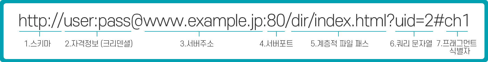

##웹과 네트워크의 기본 - 02

###HTTP와 관계가 깊은 프로토콜 IP/TCP/DNS

####1.IP - 배송 담당

IP는 네트워크 계층에 해당하며 IP라 Internet Protocol이라는 과장된 이름이지만 **IP는 인터넷을 활용하는 대부분의 시스템에 사용**된다. IP는 TCP/IP라는 명칭의 일부가 될 정도로 중요한 프로토콜이다. 

IP의 역활은 **각각의 패킷을 상대방에게 전달하는 것이다.**  상대방에게 전달하기까진 여러 가지 요소가 필요로 하며 그중에 **IP주소와 MAC(Media Access Control Address) 주소 요소가 가장 중요**하다.

- IP주소: 각 노드에 부여된 주소를 가리킴 (변경가능)
- MAC주소: 각 네트워크 카드에 할당된 고유의 주소 (변경 불가)

IP주소와 MAC주소는 서로 연관되어 있다.

#####통신은 ARP를 이용하여 MAC 주소에서 한다.

IP통신은 MAC 주소에 의존한다. 인터넷에 통신 상대가 같은 랜선 내에 있을 경우는 적기 때문에 여러 대의 컴퓨터와 네트워크 기기를 중계해서 상대방에게 도착한다. 중계하는 동안에는 다음으로 중계할 곳의 MAC 주소를 사용하여 목적지를 찾아간다. 이때 ARP(Address Resolution Protocol)이라는 프로토콜을 사용한다.

**ARP는 주소를 해결하는 프로토콜 중 하나고 수신지의 IP 주소를 바탕으로 MAC 주소를 조사한다.**

#### 그 누구도 인터넷 전체를 파악하고 있지는 않다

목적지까지 중계를 하는 도중에 컴퓨터와 라우터 등의 네트워크 기기는 목적지에 도착하기까지 **대략적인 목적지**만 알고 있다.

이 시스템을 **라우팅**이라 부르며 **어떤 컴퓨터나 네트워크 기기도 인터넷 전체를 상세하게 파악하고 있지 못한다.**

####2.TCP - 신뢰성 담당

TCP(Transfer Control Protocol)는 트랜스포트 계층이고 신뢰성 있는 **바이트 스트림 서비스**를 제공한다.

여기서 바이트 스트림 서비스란?

용량이 큰 데이터를 보내기 쉽게 TCP 세그먼트라고 불리는 단위 패킷으로 작게 분해하여 관리하는 걸 말한다.

1. 대용량의 데이터를 보내기 쉽게 작게 분해해 상대에게 보낸다.
2. 정확하게 도착했는지 확인하는 역활을 담당한다.

#####상대에게 데이터를 확실하게 보내는 것이 일

TCP는 상대에게 확실하게 데이터를 보내기 위해 "쓰리 웨이 핸드셰이킹(Tree way handshaking)"이라는 방법을 사용한다.

**STN**와 **ACK**라는 TCP 플래그를 사용하는데 이건 패킷을 보내는게 끝이 아니라 보내졌는지 여부를 상대에게 확인한다. 

1. 송신측은 최초 'SYN' 플래그로 상대에게 접속함과 동시에 패킷을 보낸다.
2. 수신측은 'SYN/ACK' 플래그로 송신측에 접속함과 동시에 패킷을 수신한 사실을 전한다.
3. 송신측이 'ACK'플래그를 보내 패킷 교환이 완료 됨을 전한다.

**이 과정중 통신이 끊어지면 TCP는 그와 동시에 같은 수순을 패킷을 재전송한다.**

TCP는 쓰리웨이 핸드셰이킹 외에도 다양한 시스템을 갖추고 있다.

####3.DNS - 이름 해결을 담당

DNS(Domain Name System)는 HTTP와 같이 응용 계층 시스템에서 **도메인 이름과 IP 주소 이름 확인**을 담당한다. 컴퓨터에서 IP 주소와는 별도로 호스트 이름, 도메인 이름을 붙일 수 있다. 

사용자는 IP 주소대신 이름을 붙여 상대방 컴퓨터를 지정한다. 물론 사람이 사용하기에는 IP 주소처럼 숫자로 나열한 방법보다 영어와 숫자로 지정해둔게 편하겠지만 컴퓨터는 반대로 IP주소가 더 편하다 이 문제를 해결할 수 있는건 DNS 덕분이다. DNS는 도메인명에서 IP 주소로 IP 주소에서 도메인명으로 조사하는 서비스이다.

#### HTTP와의 관계

####URI와 URL

- URL(Uniform Resource Locator)이란 웹 브라우저 등으로 웹 페이지를 표시하기 위해 입력하는 주소이다.
- URI(Uniform Resource Identifiers)의 약자이며 **RFC2396**[^1]에서는 각자의 단어마다의 정의되어있다.

[^1]:RFC(Request for Comments) 문서는 비평을 기다리는 문서라는 의미로, 컴퓨터 네트워크 공학 등에서 인터넷 기술에 적용 가능한 새로운 연구, 혁신, 기법 등을 아우르는 메모

##### Uniform

**통일(Uniformity)된 서식을 결정**하고 **여러 가지 종류의 리소스 지정 방법을 같은 맥락에서 구별없이 취급**한다. 새로운 **스키마(http:, ftp 등)도입**에 용이하다

#####Resource

리소스의 정의는 **'식별 가능한 모든 것'** 이며 도큐멘트 파일, 이미지, 서비스(일기 예보)등 다른 것과 구분할 수 있는 것은 모두 리소스이다. **단일한 부분과 복수의 집합도 리소스로 파악 가능**하다.

##### Identifier

**식별 가능한 것을 참조하는 오브젝트** 이며 식별자 라고 불린다. URI는 스키마[^2]를 나타내는 리소스 식별하기 위한 식별자

[^2]:리소스를 얻기 위한 수단에 이름을 붙이는 방법

HTTP의 경우에는 'http'를 사용한다. 그 외에도 'ftp', 'mailto', 'telnet', 'file'등이 있다. URI 스키마는 인터넷 상의 자원 관리 등 비영리 법인 ICANN 산하 조직인 IANA에 등록되어 있고 30개정도 있다.

URI는 리소스를 식별하기 위해 문자열 전반을 나타내는데 비해 URL은 리소스의 장소(네트워크 상의 위치)를 나타낸다. URL은 URI의 서브셋이다.

#### URL 포맷

1. 완전 수식 절대 URI or 완전 수식 절대 URL
   - **필요한 정보 전체를 지정**
2. 상대 URL
   - 브라우저 중 기준 URI에서 **상대적 위치를 */images/log.gif와 같이 지정**
3. 절대 URI 포맷
   1. 스키마
   2. 자격정보(크리덴셜)
   3. 서버주소
   4. 서버포트
   5. 계층적 파일 패스
   6. 쿼리 문자열
   7. 프래그먼트 식별자 

절대 URI 포맷에는 7가지 형태로 나눠진다.

##### 스키마

리소스를 얻기 위해 사용하는 프로토콜을 지시하며 http: 와 https: 같은 스키마를 사용합니다. 대문자와 소문자는 무시되며 마지막에 ( : ) 콜론이 하나 붙는다.

data: 와 javascript: 등 데이터와 프로그램을 지정할 수 있다.

#####자격정보(크리덴셜)

서버로부터 리소스를 취득하는데 자격정보(크리덴셜)가 필요로 하며 유저명과 패스워드로 지정 가능하다. 자격정보는 옵션사항이다.

#####서버주소

서버의 접속 대상이 되는 네트워크 포트 번호를 지정한다. 옵션으로 선택 사항이며 생략시 디폴트 포트가 사용된다.

##### 계층적 파일 패스

특정 리소스를 식별하기 위해서 서버 상의 파일 패스를 지정한다. **UNIX 디렉토리 지정 방법**과 비슷하다.

##### 쿼리 문자열

파일 패스로 지정된 리소스에 임의의 파라미터를 넘겨주기 위해 **쿼리 문자열[^3]**을 사용하며 **옵션 사항**이다.

[^3]:데이터를 전달하기 위한 URL의 일부분, 변수=값&변수=값&변수=값...의 형식

#####프래그멘트 식별자

취득한 리소스에서 **서브 리소스를 가리키기 위해서** 프래그멘트 식별자 사용하며 **옵션 사항**이다.

